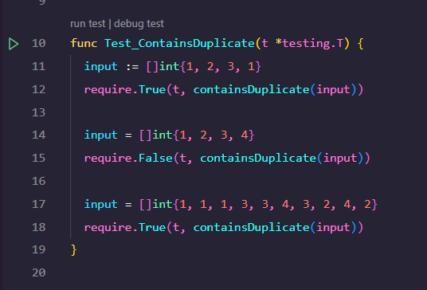

# Design-Patterns-Go

A place to put all my design patterns example implementations

#### Running on the command line

```bash
# Run all tests
go test -v ./...
# Run specific test by name
go test -v ./... -run <TEST_NAME>
# Run specific test by file
go test -v <FILE_NAME>.go
```

#### Running on the IDE (vscode)

1. Install the golang plugin
2. Just click on the green arrow next to the test function

